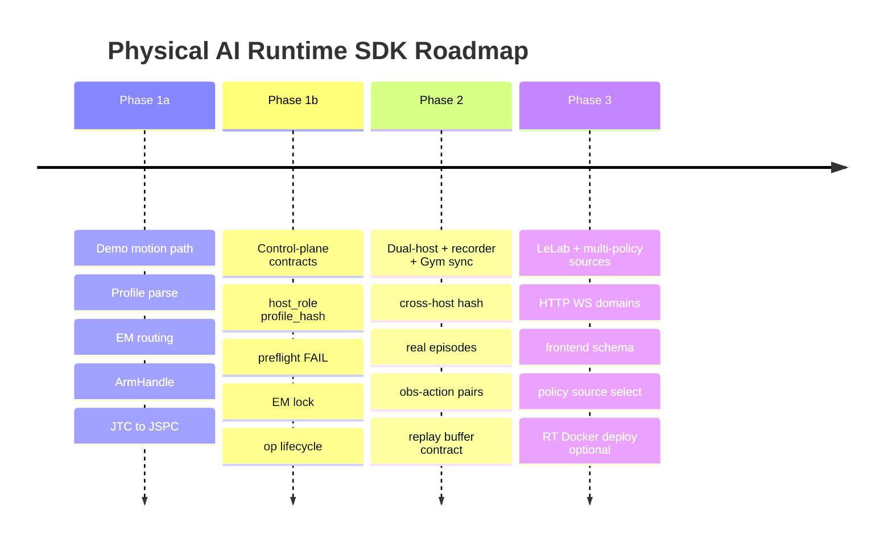

# Orchestrator: Master Plan & Architectural Roadmap

> **Boundary update (2026-08-09):** RMI is the canonical execution
> implementation. This plan describes an upper-level consumer of RMI; it must
> not synthesize a legacy EM or duplicate provider/controller ownership.
> Behavior trees are one possible future task architecture, not a requirement.

This document is the **roadmap and status** companion to
[`RUNTIME_ORCHESTRATION.md`](RUNTIME_ORCHESTRATION.md) (normative API/contract).
When they disagree, update both; do not leave divergent ownership stories.

## 1. Vision

The Runtime Orchestration SDK is the control-plane abstraction for Physical AI
Runtime: one **unified profile**, session ownership, FeatureSchema, and transport
to EM / sensors / recorder—serving policies, Gym online-RL, teleop, and
LeLab-class frontends.

```text
+-------------------------------------------------------------------------+
|     AI Policy / Gym Online-RL / Teleop / LeLab (HTTP/WS) / Agent        |
+-------------------------------------------------------------------------+
                                    |
                    Runtime Orchestration SDK (Python)
          +------------------+------------------+------------------+
          |                  |                  |                  |
   Unified Profile    Session / Operation   FeatureSchema    Host-role
   + profile_hash     owner & domains       + Gym / LeRobot  bringup views
          |                  |                  |                  |
          +------------------+------------------+------------------+
                                    |
                       Transport Adapter (ROS 2 DDS)
          +------------------+------------------+------------------+
          |                  |                  |                  |
         EM            ros2_control        episode_recorder   LAN policy sources
   (arbitrates all     (JTC/JSPC/TSKPC)    (authoritative      (one or many;
    action sources)                         MCAP)               EM picks winner)
```

### Design principles (aligned with the contract doc)

1. **Control / data plane split** — SDK owns session ownership, operations,
   routing, and schema; raw MCAP stays with `episode_recorder`. Online-RL
   experience streams are a separate writer with shared FeatureSchema, not a
   substitute for MCAP.
2. **Zero hardware hardcoding** — vendors/joints/cameras/controllers only in
   unified profile YAML (`host_roles`, streams, recorder, features).
3. **EM owns priority / non-preemption** — multiple action sources on the LAN;
   EM arbitrates. SDK does not re-implement that FSM.
4. **Online RL is core** — local experience collector + remote trainer over
   RPC; Gym `reset`/`step`; obs–action sync and replay-buffer contracts.
5. **LeLab is a primary client** — domain HTTP/WebSocket APIs + frontend-safe
   schema; reuse LeRobot feature/dataset pieces where they fit; optional MCP→SDK.
6. **Launch ownership is staged** — see §2. Docker on the RT host is a later
   deployment option, not the multi-policy mechanism.
7. **Borrow UX/data boundaries, not transports** — r2 tickets/modes; neuracore
   collector/remote trainer; never ZMQ/pickle or `log_*`-as-MCAP (see §2.6).

---

## 2. Clarified product decisions

### 2.1 Launch ownership (present → target)

| Stage | Who composes processes | Config truth |
| --- | --- | --- |
| **Present (main)** | ROS 2 launch graphs in apps/packages | Often package-local YAML + launch args |
| **Transition** | SDK may invoke `ros2 launch` via profile-driven helper | Unified profile becomes the single source; launch files are thin |
| **Target** | SDK replaces ad-hoc launch orchestration once APIs and deps are stable | One profile → `host_role("rt_host"\|"policy_host")` + shared `profile_hash` |

Goal: no more divergent multi-launch / multi-config stacks for the same robot.
`ros2 launch` may remain a low-level process tool; **orchestration ownership**
moves to the SDK + unified profile.

### 2.2 Multi-policy = multiple LAN action sources (arbitrated)

**Product intent:** on the same LAN / ROS domain, several policy (and
non-policy) **action sources** can exist; one **arbitrator** chooses who
commands the robot.

```text
  teleop src ----\
  trajectory -----\
  planner ---------+-->  arbitrator (priority / timeout / route)  --> ros2_control
  policy_a --------/
  policy_b -------/
```

**Present implementer of “arbitrator”:** Execution Manager (EM).

**SDK refactor path for EM (yes, planned as evolution):**

1. **Now** — EM enforces; SDK session owner + profile describe sources.
2. **Now implemented for Marvin/Demo9** — RMI loads EM providers and sources
   directly from the unified profile; there is no second source/priority YAML.
   Other embodiments can add this optional deployment view when they host an
   authoritative EM server.
3. **Later** — arbitration *API* is fully behind the SDK; the RT component may
   still be EM, an EM successor, or another Runtime-owned process. It must
   remain on the RT control path (not Python HTTP).

Clients (LeLab, policies, Gym) should depend on **SDK + profile**, not on
talking to EM internals. That is what “SDK refactors EM” means operationally.

### 2.3 Docker on the RT host (deployment, later)

Later, the RT host stack (drivers, `ros2_control`, EM, …) may be deployed with
**Docker**. That is packaging/ops for the RT machine. It does **not** redefine
multi-policy: policies remain LAN action sources; EM still arbitrates.

### 2.4 Gym / distributed online RL (core) — collector vs cloud trainer

```text
Physical site                         Cloud / training site
  Runtime SDK + collector  --RPC-->     policy trainer / learner
  (obs+action experiences)              (updates policy weights / serves policy)
  actions via EM policy source
```

Roadmap must include:

- local **experience collector** (synced obs–action pairs, Gym `reset`/`step`);
- **RPC** (or equivalent) to a remote **policy trainer**—not only same-host RL;
- replay-buffer placement (collector-side, trainer-side, or both) with explicit
  schema and drop/lag rules;
- trained/serving policies re-enter the robot only as EM action sources.

**Conflict with high-quality `episode_recorder` capture** is acknowledged:

- MCAP path = authoritative offline dataset (post-process / export);
- RL path = low-latency experience stream for training over RPC.

Design rule: same profile and feature names; **two writers**; orthogonal
status; never treat RPC experience upload as episode finalize.

### 2.5 LeLab / HTTP-WebSocket (key)

Enough SDK surface must exist for a frontend without ROS in the browser:

- Domains: `capabilities`, `sessions`, `episodes`, `actions`, `operations`,
  and later `policies`;
- Frontend-safe capability/schema (no vendor names / topic strings as UI
  primary data);
- Prefer reusing LeRobot feature dicts and offline dataset conventions.
- Optional later: thin **MCP → SDK** adapter for agents (same domains; no ROS).

### 2.6 Patterns borrowed from reference SDKs

Neither [r2_labs](https://github.com/Reimagine-Robotics/r2_labs) nor
[neuracore](https://github.com/NeuracoreAI/neuracore) is “ROS 2 + EM +
authoritative MCAP.” Borrow strengths; keep our arbitration and recording.

**From r2_labs (control-plane UX) → Phase 1b / 3**

| Borrow | Maps onto our SDK |
| --- | --- |
| Behaviour ticket wait/cancel/terminal reason | `Operation` lifecycle (not succeed-on-publish) |
| Exclusive ExecMode + `available_modes` | Session owner + queryable EM active source |
| Split Arm / Recording / Episode clients | Domain HTTP/WS + in-process APIs |
| Optional MCP for agents | Thin MCP→SDK; never MCP→ROS |

Reject from r2: ZMQ + pickle control protocol; appliance-only robot server as
the multi-policy model.

**From neuracore (learning-plane boundary) → Phase 2**

| Borrow | Maps onto our SDK |
| --- | --- |
| Local data daemon / collector | Experience collector near the robot |
| Timestamped `log_*` stream | Stamped RL experience schema (shared FeatureSchema names) |
| Cloud train → `policy.predict` | Remote trainer RPC → LAN policy action source via EM |
| Explicit robot connect description | Unified profile + FeatureSchema (YAML, not URDF-only) |

Reject from neuracore: `log_*` as MCAP replacement; cloud platform as hard SDK
dependency; training-job orchestration inside SDK core.

One-line rule: **r2 for tickets/modes/domains/MCP; neuracore for
collector/stamps/remote trainer; neither replaces EM or episode_recorder.**

---

## 3. Codebase map (`orchestrator` ROS/Python package)

```text
Configuration & Preflight   embodiment_config, preflight
Session & Operations        session, operation, orchestrator
Motion & Safety             group_handle, action_normalizer, safety_guard
Schema & Data               feature_schema, gym_adapter, dataset_exporter, episodes
Transport & Bringup         transport_adapter, observation_reader, launch_helper
Gateway                     server, cli, calibration_manager
```

### Honest readiness (do not treat as production until contract tests pass)

| Area | Status | Notes |
| --- | --- | --- |
| RMI execution foundation | **Demo-proven** | Demo 1–9 validate local and distributed fake-HW capability |
| Unified profile (`host_role`, `profile_hash`, streams) | **Implemented** | `rmi.EmbodimentConfig` is the canonical parser/model and RMI owns the installed production profiles |
| Preflight required FAIL / type / QoS | **Gap** | Still weak WARN-centric checks |
| Session owner → EM lock, Operation lifecycle | **Gap** | Owner often in-process only; ops succeed too early |
| Episode ↔ recorder | **Implemented** | Direct Recorder SDK lifecycle; finalizer-owned path and checksum inventory are verified |
| HTTP/WS + LeLab domain API | **Shell** | Handlers incomplete; not a real gateway yet |
| Gym / online-RL sync + replay buffer | **Prototype** | Adapter scaffold; not a designed RL data path |
| Vendor-free core | **Gap** | `VENDOR_LAUNCH_MAP`, `fr3_joint*` still present |

Contract tests under `test/test_contract_*.py` encode the gaps. Prefer fixing
code until those pass over declaring modules “Production Ready.”

---

## 4. Strategic goals

1. **Unified profile multi-embodiment** — one YAML drives RT and policy hosts.
2. **RMI ActionProviders** — priorities are deployment-configurable; provider
   lifecycle, arbitration and controller switching stay in RMI.
3. **Process lifecycle** — profile-driven bringup; clean process-group teardown;
   zero orphans after SDK stop.
4. **Online RL + LeRobot/LeLab** — local collector ↔ remote trainer RPC; Gym
   core path; LeLab via HTTP/WS; LeRobot features/export reused where appropriate.
5. **Multi-policy on the LAN** — several named policy action sources; EM
   arbitrates; SDK exposes discovery/selection under the session owner.

---

## 5. Phased roadmap



### Phase 1a — Demo motion path (largely done)

- [x] Profile YAML load for Marvin / Piper-style embodiments.
- [x] EM four-source routing used from SDK transport.
- [x] `ArmHandle` / `GripperHandle` including trajectory and joint_reference stream.
- [x] Fake-HW bimanual JTC → JSPC switching demonstrated.
- [x] Bringup helper process-group cleanup direction (`SIGINT`→`SIGKILL`).
- [x] Doc lock: far pose / SE3 dense sampling = **motion_planners** streaming
      Cartesian pose-sequence family (not atomic `ArmHandle` API); code move
      deferred — see [`MOTION_PLANNER_SOURCE_INTERFACE.md`](MOTION_PLANNER_SOURCE_INTERFACE.md).

### Phase 1b — Control-plane contracts (current engineering focus)

Exit when `test/test_contract_*.py` is green (or explicitly waived per test):

- [ ] `host_role` + `profile_hash` + `resolve_launch_spec` from profile (no vendor map).
- [ ] No `fr3_joint*` (or other embodiment) hardcoding in core modules.
- [ ] `resolve_streams` required FAIL / type mismatch; arm rejected on FAIL.
- [ ] `prepare` accepts only `EmbodimentConfig`; Path must not silently pass.
- [ ] Session activate locks EM source; **queryable** active owner/source.
- [ ] Operations are tickets: stay RUNNING until transport completes; cancel +
      terminal failure/cancel reasons.
- [ ] Cartesian publish fills pose fields.
- [x] Episode idempotency; manifest uses real `profile_hash` and hashes the
      recorder-owned `checksums.sha256` inventory after finalization.

### Phase 2 — Dual-host, recorder truth, online-RL collector↔trainer RPC

- [x] RT host + policy host from one profile; EM publishes the authoritative
      `profile_hash`, and `RuntimeSession.prepare()` rejects missing/mismatched
      identity before any provider prepare/acquire side effect.
- [x] Wire episodes to authoritative `episode_recorder` finalize/health.
- [ ] Local experience collector (process boundary): owner-gated Gym `reset`/`step`;
      stamped obs–action sync rules (neuracore-style daemon split, our schema).
- [ ] RPC contract between local collector and remote policy trainer (schema, batching, clocks).
- [ ] Replay-buffer contract distinct from MCAP (collector and/or trainer side).
- [ ] Trained/serving policy re-enters only as a named EM policy action source.
- [ ] Safety guard workspace bounds driven by profile where applicable.

### Phase 3 — LeLab gateway, multi-policy sources, optional RT Docker

- [ ] Real HTTP + WebSocket domain APIs for LeLab/reference UI.
- [ ] Frontend-safe capability/schema export.
- [ ] `policies` domain: list/select among LAN policy action sources under the session owner.
- [ ] Offline MCAP → LeRobot dataset exporter (separate gate from online RL).
- [ ] Optional: thin MCP → SDK adapter for agents (same domains; no ROS).
- [ ] Optional: package RT host stack with Docker (deployment only; EM still arbitrates).

---

## 6. Verification gates

1. **Contract tests**: the `orchestrator/test/test_contract_*.py` suite must pass for Phase 1b exit.
2. **Unit / integration**: package tests pass under the workspace Pixi env.
3. **Process cleanliness**: no orphan `execution_manager` / `ros2_control_node` / `rviz2` after SDK `close`.
4. **EM arbitration**: lower/same-source preemption rules enforced by EM, exercised via SDK.
5. **Idempotency**: repeated session/episode/policy-attach commands do not double-fire ROS transitions.
6. **Cross-host**: RT and policy hosts share `profile_hash` before arming control or recording.
7. **LeLab API**: HTTP/WS contract tests for domain handlers and frontend-safe schema.
8. **Recording authority**: multi-camera MCAP throughput remains the recording performance gate; RL buffer metrics are separate.
